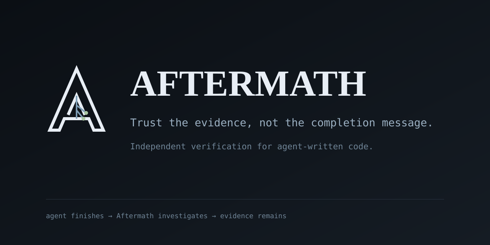

# Acquisition Brief — always writes .aftermath/runs/<n>/summary.json

**Date:** 2026-09-22  
**Repository:** https://github.com/theworker02/aftermath  
**Default branch:** `main`  
**Primary language:** TypeScript  
**Status:** Diligence briefing only. **No acquisition has occurred** by virtue of this file.  
**License:** Proprietary — sale, written commercial license, or completed asset transfer required (see root `LICENSE`).  
**Valuation:** Not stated.  
**Contact:** GitHub [@theworker02](https://github.com/theworker02) · [thanks.dev/u/gh/theworker02](https://thanks.dev/u/gh/theworker02)

> Cloning or forking this repository does **not** grant production, redistribution, SaaS, OEM, or commercial rights.

---

## 1. Executive thesis

 <strong>Trust the evidence, not the completion message.</strong><br/> Independent verification for agent-written code.

**Why a buyer cares:** always writes .aftermath/runs/<n>/summary.json packages transferable product IP — source, docs, in-repo brand assets, and a diligence room under `docs/acquisition/` — under a clear proprietary posture so diligence can proceed without mistaking the repo for open source.

---

## 2. Product snapshot

| Item | Detail |
|------|--------|
| Product | always writes .aftermath/runs/<n>/summary.json |
| Repo | `theworker02/aftermath` |
| Language | TypeScript |
| Open source? | **No** — proprietary |
| Rightsholder | theworker02 |
| Diligence pack | `docs/acquisition/` |

### Capability highlights (from current materials)

- `aftermath_verify` · `aftermath_get_receipt` · `aftermath_get_findings`
- `aftermath_get_baseline` · `aftermath_compare` · `aftermath_prepare_repair`
- `aftermath_explain_finding` · `aftermath_inspect` · `aftermath_doctor`
- `aftermath_config_validate` · `aftermath_baseline` · `aftermath_status`
- **Local-first**: no account, no required API key, no telemetry, no cloud backend
- argv-based execution (no shell interpolation)
- Destructive commands require approval
- Best-effort secret redaction; log size limits
- Untrusted repos: review `.aftermath.toml` and discovered scripts first
- Issues: [github.com/theworker02/aftermath/issues](https://github.com/theworker02/aftermath/issues)
- Support guide: [SUPPORT.md](./SUPPORT.md)
- Sponsors: [github.com/sponsors/theworker02](https://github.com/sponsors/theworker02) · [thanks.dev/u/gh/theworker02](https://thanks.dev/u/gh/theworker02)

---

## 3. Problem / opportunity

Teams evaluating always writes .aftermath/runs/<n>/summary.json typically need either (a) a commercial right to run or embed it, or (b) outright ownership of the Product IP for strategic build-out. Public GitHub visibility without a proprietary license creates false assumptions about free production use. This brief and the linked data room make the commercial path explicit.

---

## 4. What ships today

Honest maturity: treat repository contents, README claims, tests, and release tags as the source of truth. Do not assume production customers, ARR, filed patents, or SLAs unless separately evidenced in diligence.

Typical transferable surfaces:

- Source tree and build/test scripts present in-repo
- Documentation and design notes
- Acquisition / diligence markdown under `docs/acquisition/`
- Branding assets committed to the repository (if any)

---

## 5. Demo / evaluation path (buyer)

Minimal path (no secrets required unless README says otherwise):

```
```text
claims  vs  evidence
```
```text
Cursor Agent
    ↓
"Implementation complete"
    ↓
Aftermath
    ↓
Build       PASS
Tests       FAIL (4)
Lint        +2 warnings
API         1 break
Deps        lockfile drift
    ↓
PARTIALLY VERIFIED
```
```text
Repository → Detect → Baseline → Diff → Discover commands → Plan
    → Execute → Artifacts → Compare → Findings → Receipt (+ summary.json)
```
```powershell
./scripts/link-cursor-plugin.ps1
```
```bash
./scripts/link-cursor-plugin.sh
```
```bash
npm install
npm run build
node dist/cli/index.js doctor
node dist/cli/index.js verify
```
```bash
aftermath verify
aftermath verify --ci --json
aftermath status
aftermath config validate
aftermath inspect latest
```

Extended evaluation: `docs/acquisition/BUYER_EVALUATION.md`. Written NDA / evaluation grants may be required for private materials.

---

## 6. What a transaction typically includes

Subject to definitive schedules:

| Included (typical) | Excluded (typical) |
|--------------------|--------------------|
| Repo materials + asserted original IP | Seller personal accounts / unrelated repos |
| Docs + diligence room at closing | Third-party dependency source under separate licenses |
| In-repo brand marks as assigned | Secrets without rotation plan |
| Know-how captured in docs | Fabricated revenue, user, or adoption metrics |

---

## 7. Suggested deal structures

| Structure | When it fits |
|-----------|--------------|
| Non-exclusive commercial license | Deploy/run under seat or environment terms |
| Exclusive field-of-use license | Buyer wants exclusivity; seller may retain entity |
| Asset / IP assignment | Buyer wants ownership of Materials outright |
| OEM / redistribution | Separate agreement — not implied here |

Commercial terms (price, earnouts, escrow) are negotiated under NDA with counsel.

---

## 8. Buyer diligence checklist

- [ ] Confirm Rightsholder identity and authority to sell/license
- [ ] Inventory Materials (`docs/acquisition/ASSET_INVENTORY.md`)
- [ ] Review IP posture (`IP_PROVENANCE.md`) and dependencies (`DEPENDENCY_INVENTORY.md`)
- [ ] Run evaluation script (`BUYER_EVALUATION.md`)
- [ ] Review risks (`RISK_REGISTER.md`)
- [ ] Agree transfer scope (`TRANSFER_MANIFEST.md`) and handoff (`HANDOFF_CHECKLIST.md`)
- [ ] Supersede root `LICENSE` at closing via definitive agreement

---

## 9. Related documents

| Document | Purpose |
|----------|---------|
| `LICENSE` | Proprietary — no default grant |
| `docs/acquisition/README.md` | Data-room index |
| `docs/acquisition/EXECUTIVE_SUMMARY.md` | One-page thesis |
| `README.md` | Product overview |
| `SECURITY.md` | Vulnerability reporting |
| `COMMERCIAL.md` | Licensing contact path |
| `.github/FUNDING.yml` | Sponsors / thanks.dev |

---

## 10. Disclaimer

This package is informational and **does not** create a binding offer, grant of rights, or investment advice. Engage counsel for any transaction.

---

*Document version: 2.0.0 / 2026-09-22 · Classification: acquisition briefing*
